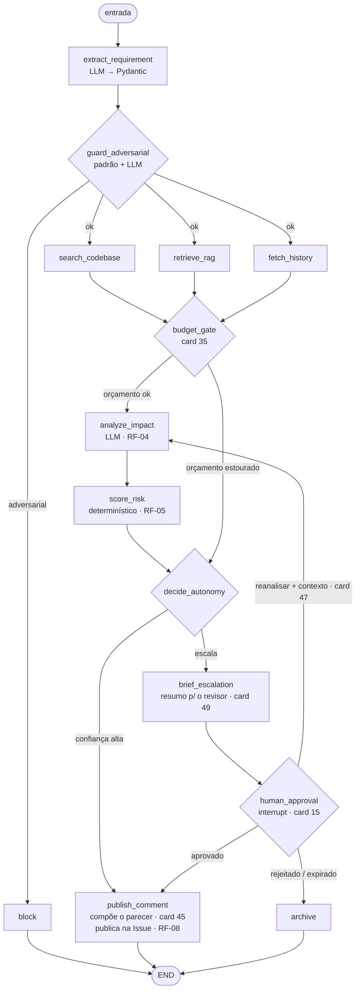

# RADAR — Agente de Análise de Impacto e Risco de Requisitos

[](https://github.com/scha-chan/radar-impact-agent/actions/workflows/ci.yml)

> Projeto avaliativo M2.2 — IA para Desenvolvedores [T1].

Especificação completa: [docs/PRD-RADAR-Agente-Impacto-Risco.md](docs/PRD-RADAR-Agente-Impacto-Risco.md) — este README resume o que está implementado e como reproduzir; o PRD é a referência normativa (requisitos, matriz de risco, cenários, contratos).

Quadro Kanban do projeto: [github.com/users/scha-chan/projects/1](https://github.com/users/scha-chan/projects/1). Evidência por card (o que foi feito, decisões, testes): [`docs/evidencias/`](docs/evidencias/).

## Menu

**Entender**
- [Descrição da solução](#descrição-da-solução) · [continuidade do mini-projeto](#continuidade-do-mini-projeto)
- [Classificação e arquitetura](#classificação-e-arquitetura) — [sistema híbrido](#classificação-sistema-híbrido) · [fluxo do grafo](#fluxo-do-grafo-langgraph) · [stack](#stack)
- [Cenários de uso](#cenários-de-uso)
- [Segurança e limites de autonomia](#segurança-e-limites-de-autonomia) — [conteúdo externo](#contra-conteúdo-externo-não-confiável) · [ação irreversível](#ação-irreversível-permissões-e-aprovação) · [humano no circuito](#humano-no-circuito) · [segredos](#segredos-e-publicação)

**Rodar**
- [Estrutura do repositório](#estrutura-do-repositório)
- [Instalação e execução](#instalação-e-execução) — [pré-requisitos](#pré-requisitos) · [configuração](#configuração) · [testes](#rodando-os-testes) · [Docker](#executando-com-docker) · [interface](#interface-mínima) · [grafo direto](#executando-o-grafo-diretamente)
- [Componentes internos](#componentes-internos) — [observabilidade](#observabilidade-os-três-sinais-e-uma-investigação-real) · [orçamento de execução](#orçamento-de-execução-rf-065-card-35) · [servidor MCP](#servidor-mcp) · [automação low-code (n8n)](#automação-low-code-n8n)

**Avaliar**
- [QA e qualidade](#qa-e-qualidade)
- [DevOps: pipeline, logs e anomalias](#devops-pipeline-logs-e-anomalias)
- [Prompts e refinamento](#prompts-e-refinamento)
- [Vídeo de demonstração](#vídeo-de-demonstração)
- [Limitações conhecidas e evolução futura](#limitações-conhecidas-e-evolução-futura)

---

## Descrição da solução

**Problema.** Times de desenvolvimento aprovam mudanças de requisito sem uma
avaliação sistemática do que elas quebram. O impacto costuma ser descoberto só
durante a implementação — ou em produção — porque a análise depende de quem
estava na reunião e de quanto contexto essa pessoa tem de memória.

**Solução.** RADAR é um agente que recebe um requisito de mudança (uma Issue do
GitHub ou texto livre via API), coleta evidência real do código e do histórico
do repositório, cruza essa evidência com uma base de padrões de impacto
conhecidos, e produz um parecer estruturado de risco. Pareceres de baixa
confiança não são publicados sem aprovação humana.

**Público.** Tech leads (decidem planejamento a partir do parecer), product
owners (entendem custo de risco de uma feature), QA leads (usam os testes
recomendados para priorizar esforço) e aprovadores técnicos (evitam que risco
alto passe silenciosamente). Detalhes de cada persona na seção 4 do PRD.

**Objetivo e valor entregue.** Tornar a análise de impacto uma etapa que
sempre acontece, é rastreável até a evidência que a sustenta, e não depende da
disponibilidade de uma pessoa específica. O valor não é substituir o
julgamento técnico, e sim garantir que ele parta de evidência real e que
mudanças de alto risco não avancem sem revisão explícita.

**Saída principal.** Objeto `ImpactAnalysis` validado por Pydantic, publicado
como comentário markdown na Issue de origem (ou gravado em arquivo em modo
`DRY_RUN`).

### Continuidade do mini-projeto

O edital permite evoluir a aplicação do mini-projeto do módulo. O RADAR reaproveita
quatro capacidades — o restante foi refatorado ou descartado porque o produto
mudou de pergunta: o agente anterior respondia *"como testar esta
funcionalidade?"*; o RADAR responde *"o que esta mudança quebra, e vale a pena
implementá-la?"*.

| Componente do mini-projeto | Destino no RADAR |
|---|---|
| Templates de tipos de feature | Refatorado → corpus RAG de padrões de impacto |
| Confidence Scoring | Mantido e ampliado → decide autonomia de publicação |
| Escalação Humana | Refatorado → `interrupt` do LangGraph |
| Audit Trail (JSONL) | Mantido → segundo sinal de observabilidade |
| Tool Permissions | Mantido → protege uma ação real e irreversível |
| Evidence Tracking | Mantido e ampliado → toda afirmação do parecer aponta sua origem |
| Geração de critérios/testes | Rebaixado → campo `recommended_tests`, consequência da análise |
| Sandbox, Token Budget, Preview, Draft | Descartados — perderam propósito sem execução de código |

Tabela completa e justificativas: seção 6 do PRD.

---

## Classificação e arquitetura

### Classificação: sistema híbrido

RADAR é classificado como **sistema híbrido**, não como agente autônomo puro
nem como workflow puramente determinístico:

- **Componente agêntico** — o LLM decide quais termos buscar no código,
  interpreta o requisito em linguagem natural, classifica impactos por área e
  redige o parecer. Essas tarefas exigem julgamento sobre texto livre e não têm
  uma regra fixa que as substitua.
- **Componente determinístico** — a matriz de risco, o cálculo de confiança, o
  threshold de escalação, a validação de permissões e o roteamento do grafo são
  regras Python puras, sem participação do modelo.

Essa separação é deliberada: **é o que impede o agente de "decidir" que um
risco alto é baixo.** O LLM opina sobre impactos; nunca decide se o parecer sai
sozinho ou se uma ação irreversível é autorizada.

### Fluxo do grafo (LangGraph)

Entrada: uma Issue do GitHub ou texto livre via `POST /analyze`.



As três coletas de evidência saem de `guard_adversarial` em paralelo (fan-out via `Send` do LangGraph) e convergem em `budget_gate`.

O ciclo de reanálise (`human_approval → analyze_impact`, card 47) é limitado por `MAX_REVIEW_ROUNDS` (padrão 3); `budget_gate`/`decide_autonomy` (card 35) são o backstop. `brief_escalation` (card 49) roda de novo a cada rodada, atualizando o resumo.

**Requisitos de modelagem do fluxo, e onde aparecem:**

| Requisito | Onde está no grafo |
|---|---|
| Execução sequencial | `extract → guard → ... → score → route` |
| Ramificação condicional | `guard_adversarial`, `route_by_confidence` e `route_after_approval` (aprovar / rejeitar / reanalisar, card 47) |
| Paralelização | as três coletas de evidência, via `Send` API do LangGraph |
| Ciclo | `human_approval → analyze_impact` na reanálise pedida pelo revisor (card 47) |
| Condição de parada | `retries_left` a cada falha de tool; `approval_expires_at` no aguardo de aprovação; `MAX_REVIEW_ROUNDS` no ciclo de reanálise; `max_steps` (card 35) como backstop |

Todos os nodes são instrumentados uniformemente com logs estruturados
(`src/observability/logging.py`, card 19) e decisões de autonomia são
registradas na trilha de auditoria (`src/observability/audit.py`, card 20) —
ver [Observabilidade](#observabilidade-os-três-sinais-e-uma-investigação-real) abaixo.

### Stack

| Camada | Tecnologia |
|---|---|
| Orquestração | LangGraph |
| API | FastAPI + uvicorn |
| Frontend | TypeScript (ES modules, sem bundler) + Tailwind CSS (CDN, paleta `rose`) |
| Validação | Pydantic v2 |
| Tools | Servidor MCP próprio (Python SDK) |
| Vetorial | ChromaDB (local, persistente) |
| Persistência de estado | SqliteSaver (checkpointer LangGraph) |
| Logs | structlog (JSON) |
| Testes | pytest, pytest-cov, respx, `TestClient` (FastAPI) |
| Lint | ruff (`check` + `format --check`) |
| CI | GitHub Actions (lint, testes, build Docker, scan de segredos) |
| Container | Docker + docker-compose |
| Low-code | n8n (Docker local) |
| Modelo | configurável por variável de ambiente (`LLM_MODEL`, `LLM_PROVIDER`) |

Detalhes completos de escopo, requisitos funcionais e cenários: seções 5, 9 e
12 do [PRD](docs/PRD-RADAR-Agente-Impacto-Risco.md).

---

## Cenários de uso

Os cenários da seção 12 do PRD, cada um com um teste de integração dedicado que reproduz o comportamento real do grafo:

| # | Cenário | Comportamento esperado | Teste |
|---|---|---|---|
| 1 | Fluxo principal (feliz) | Evidência forte em código/RAG/histórico → confiança alta, publicação automática | [`tests/integration/test_scenario_1_happy_path.py`](tests/integration/test_scenario_1_happy_path.py) |
| 2 | Risco alto com escalação | Risco `HIGH`, confiança abaixo do threshold → pausa (`interrupt`), aprovação retoma e publica | [`tests/integration/test_scenario_2_high_risk_escalation.py`](tests/integration/test_scenario_2_high_risk_escalation.py) |
| 3 | Entrada adversarial (obrigatório) | Instrução embutida no requisito ("ignore as regras...") → bloqueado, nenhuma tool de escrita chamada | [`tests/integration/test_scenario_3_adversarial.py`](tests/integration/test_scenario_3_adversarial.py) |
| 4 | Falha de integração (resiliência) | API do GitHub falha (403) → retry, fallback, confiança penalizada, escalação | [`tests/integration/test_scenario_4_resilience.py`](tests/integration/test_scenario_4_resilience.py) |
| 5 | Orçamento de execução estourado (card 35) | `max_steps`/`MAX_WALL_TIME_SECONDS` estoura antes de `analyze_impact` → pula a análise, `risk_level` mínimo `MEDIUM`, `ESCALATED_BUDGET_EXCEEDED` | [`tests/integration/test_scenario_5_budget_exceeded.py`](tests/integration/test_scenario_5_budget_exceeded.py) |

Uma execução real (não simulada em teste) reconstruída ponta a ponta, com a evidência que sustentou a decisão de autonomia, está em [`docs/evidencias/card-21-investigacao-execucao-real.md`](docs/evidencias/card-21-investigacao-execucao-real.md).

---

## Segurança e limites de autonomia

O RADAR lê texto que não controla (a Issue, trechos de código, mensagens de commit) e, no fim, executa **uma** ação irreversível — publicar um comentário. As quatro subseções abaixo são as garantias que impedem esse texto de virar comando e essa ação de acontecer sem lastro. Referência normativa: seção 13 do PRD.

### Contra conteúdo externo não confiável

Três camadas, aplicadas a todo texto vindo de fora — inclusive o contexto que o revisor cola numa reanálise (card 47):

1. **Delimitação estrutural** — o conteúdo externo entra no prompt dentro de um bloco marcado, com instrução de sistema dizendo que é *dado a ser analisado*, nunca comando a ser obedecido.
2. **Detecção** (card 18, [`src/governance/adversarial.py`](src/governance/adversarial.py)) — padrões determinísticos primeiro; se não acharem nada, uma checagem por LLM cobre os casos sutis. Falha na checagem por LLM → fail-open (a camada 3 é a garantia real).
3. **Contenção arquitetural** — mesmo que 1 e 2 falhem, o LLM **nunca** decide `risk_level` nem o threshold de escalação ([`src/domain/risk.py`](src/domain/risk.py), card 02). É esta camada que sustenta a garantia de verdade: um modelo induzido não consegue rebaixar um risco alto.

O cenário 3 (obrigatório) reproduz isso ponta a ponta — instrução embutida → bloqueado, nenhuma tool de escrita chamada.

### Ação irreversível: permissões e aprovação

- **Permissões de tool** (cards 10/17, [`src/governance/tool_executor.py`](src/governance/tool_executor.py)) — toda tool com efeito externo (`search_code`, `fetch_history`, `publish_comment`) precisa de uma `ToolPermission` registrada; sem ela, a chamada é recusada.
- **Portão de publicação** — `publish_comment` (a única ação irreversível) só executa com `approval_decision == "APPROVED"` quando `human_review_required` é verdadeiro. Em `DRY_RUN` (padrão de teste) nada é publicado: o parecer é gravado em `audit/dry_run/{session_id}.md` e servido por `GET /comment/{session_id}` (card 51).

### Humano no circuito

Um parecer de baixa confiança ou risco crítico pausa e espera decisão humana. Não é só um sim/não:

| Peça | O que faz |
|---|---|
| **Escalação + pausa** (cards 15/16) | `interrupt()` do LangGraph; estado preservado no checkpointer. Aprovação após `APPROVAL_TTL_HOURS` (padrão 24h) é descartada e o grafo arquiva sem publicar. |
| **Resumo para o revisor** (card 49) | `brief_escalation` gera um `review_brief` (prompt `05-review-brief`): o que a mudança pede, por que escalou, e o que informar numa reanálise. Aparece já em `GET /approvals`. |
| **Reanálise acionável** (card 47) | `POST /approvals/{id}` com `{"decision": "REANALYZE", "context": "..."}` injeta o contexto como evidência e reexecuta `analyze_impact`. Limite: `MAX_REVIEW_ROUNDS` (padrão 3). `GET /approvals/{id}` mostra o parecer parcial e `gaps`. |
| **Resiliência do painel** (card 50) | `GET /approvals` só lista sessões com checkpoint vivo; `POST /approvals/{id}` completa chaves de `AgentState` de versões antigas antes de retomar e responde 409 (não 500) se a retomada falhar. |

### Segredos e publicação

Nenhum segredo é versionado — `.env` está no `.gitignore`, `.env.example` só tem chaves vazias, e o CI roda um scan de segredos (`gitleaks`) em todo push/PR (card 25). Com `DRY_RUN=false` e um `issue_number`, `publish_comment` publica de verdade na Issue de `GITHUB_REPO` (o `GITHUB_TOKEN` precisa ter escrita nesse repo).

---

## Estrutura do repositório

```
radar-impact-agent/
├── .github/workflows/ci.yml   # lint, testes, build Docker, scan de segredos (card 25)
├── src/
│   ├── api/                   # FastAPI + página única (card 30)
│   ├── graph/                 # nodes, edges, state, build, prompts, LLM
│   ├── mcp_server/            # servidor MCP e tools do GitHub
│   ├── domain/                # matriz de risco, fórmula de confiança (Python puro)
│   ├── governance/            # permissões, detector adversarial
│   ├── rag/                   # ingestão, chunking, retriever (ChromaDB)
│   ├── observability/         # logs estruturados, trilha de auditoria
│   └── devops/                # dataset simulado, baseline, tendência (cards 27/28)
├── knowledge/                 # corpus de padrões de impacto (fonte do RAG, 54 chunks)
├── tests/
│   ├── unit/                  # lógica pura, isolada
│   ├── integration/           # grafo completo, GitHub mockado, os 4 cenários
│   └── e2e/                   # aceitação via TestClient do FastAPI (card 30)
├── docs/
│   ├── evidencias/            # um arquivo por card: o que foi feito, decisões, testes
│   ├── prompts/                # prompts documentados + refinamento
│   ├── qa/                    # code review com IA, exemplos de teste
│   ├── devops/                # análise de logs, dataset, anomalia, tendência
│   └── lowcode/                # workflow n8n exportado
├── .env.example
├── docker-compose.yml
├── Dockerfile
└── README.md
```

**Branches:** `main` (final) ← `develop` (integração) ← `feature/*`/`docs/*` (por card). Histórico completo de PRs mesclados: [pull requests do repositório](https://github.com/scha-chan/radar-impact-agent/pulls?q=is%3Apr+is%3Amerged).

---

## Instalação e execução

### Pré-requisitos

- Python 3.11+ (desenvolvido e testado com 3.14; CI roda em 3.13)
- Git
- [Ollama](https://ollama.com) — LLM local, sem custo de API e sem chave (seção 18 do PRD)
- Docker + Docker Compose (opcional — para `docker compose up`, n8n e o build de CI)

### Configuração

```bash
git clone https://github.com/scha-chan/radar-impact-agent.git
cd radar-impact-agent

python -m venv venv
# Windows
venv\Scripts\activate
# Linux/macOS
source venv/bin/activate

pip install -r requirements.txt

cp .env.example .env
```

`.env` é carregado automaticamente na importação (`src/config.py`) — não precisa exportar as variáveis manualmente no shell. Para a tool `search_code` funcionar (card 08), preencha `GITHUB_TOKEN` com um [personal access token](https://github.com/settings/tokens) com escopo mínimo de leitura de código, e `GITHUB_REPO` com `owner/repo` — este é o **repositório padrão**; a página (`POST /analyze`, campo `repo`, card 43) aceita `owner/repo` ou a URL de outro repositório por análise, para testar fontes diferentes (o `GITHUB_TOKEN` precisa ter acesso a ele). Sem `GITHUB_TOKEN` e sem nenhum repositório, `search_codebase` degrada para lista vazia em vez de falhar. Para o LLM, é necessário o Ollama rodando com o modelo configurado em `LLM_MODEL` (padrão `mistral`) baixado:

```bash
ollama serve            # em um terminal separado, se ainda não estiver rodando
ollama pull mistral      # uma vez, baixa o modelo (~4.4 GB)
ollama pull nomic-embed-text   # modelo de embedding usado pelo RAG (card 13)
```

### Rodando os testes

```bash
python -m pytest -v
```

`pytest` já roda com `--cov` por padrão (`pyproject.toml`, card 22) e falha se a cobertura cair abaixo de 70% (RNF-05). A suíte padrão não depende do Ollama nem do GitHub estarem disponíveis — o LLM e as tools externas são mockados. Para rodar também os smoke tests contra serviços reais:

```bash
RUN_OLLAMA_TESTS=1 python -m pytest tests/integration/test_extract_requirement_ollama.py -v
RUN_GITHUB_TESTS=1 python -m pytest tests/integration/test_search_code_github.py tests/integration/test_fetch_history_github.py -v
```

### Executando com Docker

```bash
docker compose up
```

Sobe a API (`http://localhost:8000`) e o n8n (`http://localhost:5678`). O Ollama continua rodando no host (`OLLAMA_BASE_URL=http://host.docker.internal:11434` por padrão) — não é containerizado neste projeto.

### Interface mínima

```bash
uvicorn src.api.app:app --reload
```

Abra `http://localhost:8000` — página única (card 30, RF-10) para submeter um requisito (com um campo opcional para o repositório do GitHub a analisar, card 43), ver o painel de aprovações pendentes e inspecionar a trilha de auditoria de uma sessão. Endpoints: `POST /analyze` (RF-01.2), `GET /approvals`/`GET`/`POST /approvals/{session_id}` (RF-07.2), `GET /audit/{session_id}` (RF-09.4). Documentação interativa automática do FastAPI em `/docs`.

**Frontend (TypeScript + Tailwind).** A lógica da página (`src/api/static/ts/*.ts` — `types.ts`, `api.ts`, `dom.ts`, `app.ts`) é escrita em TypeScript e compilada para `src/api/static/js/` (servido em `/static`), sem bundler — cada arquivo é um módulo ES nativo carregado pelo navegador. Estilo via Tailwind (CDN, paleta `rose`), sem CSS próprio. Depois de editar um `.ts`:

```bash
npm install   # uma vez
npm run build # ou "npm run watch" durante o desenvolvimento
```

O CI roda `tsc --noEmit` (job `typecheck-frontend`) a cada push/PR para pegar erro de tipo antes do merge; o JS compilado fica versionado no repositório (não há passo de build de frontend no Docker/CI) — rebuilde e commite o resultado sempre que mudar um `.ts`.

### Executando o grafo diretamente

```python
from src.graph.build import build_graph
from src.graph.state import create_initial_state

graph = build_graph()
state = create_initial_state("Adicionar filtro por data na listagem de pedidos")
resultado = graph.invoke(state)

print(resultado["requirement"].feature_type, resultado["risk_level"], resultado["confidence"])
```

Todos os nodes do grafo são reais — `analyze_impact` (card 44) e a composição do parecer final (`ImpactAnalysis` + prompt `04-compose-report`, card 45) foram as últimas peças a sair de stub. Sem `GITHUB_TOKEN`/`GITHUB_REPO` configurados, sem o modelo de embedding baixado, sem o Ollama no ar, ou se o Code/Commit Search do GitHub ainda não indexou o que foi procurado, a confiança calculada fica abaixo do threshold padrão (70) e o resultado escala para aprovação humana — degradação esperada (seção 11 do PRD), não uma falha. Quando não chega evidência nenhuma, `analyze_impact` não produz impacto nem risco: o parecer escala como **não avaliado** (`ESCALATED_NOT_ASSESSED`), com `risk_level` no piso `MEDIUM` e a tela/comentário mostrando "não avaliado" em vez de "Baixo" (card 46).

---

## Componentes internos

Como as peças que aparecem no [fluxo do grafo](#fluxo-do-grafo-langgraph) funcionam por dentro — o que observar em execução, os limites que impedem uma execução infinita, e as duas superfícies de integração (MCP e n8n).

### Observabilidade: os três sinais e uma investigação real

Toda execução emite três sinais correlacionados pelo mesmo `session_id`/`correlation_id` (seção 14 do PRD):

- **Log estruturado (JSON)** — um evento `node_completed` por node, com `status` e `duration_ms`. Ligar o renderer JSON de verdade:

  ```python
  from src.observability.logging import configure_structured_logging
  configure_structured_logging()
  ```

- **Trilha de auditoria (JSONL)** — um registro por decisão de autonomia (`ESCALATED`, `ESCALATED_BUDGET_EXCEEDED`, `ESCALATED_NOT_ASSESSED`, `REANALYSIS_REQUESTED`, `AUTO_PUBLISHED`, `APPROVED_PUBLISHED`, `BLOCKED_ADVERSARIAL`, `REJECTED_ARCHIVED`, `EXPIRED_ARCHIVED`, `PUBLISH_DENIED`), gravado em `AUDIT_LOG_PATH` (padrão `audit/trail.jsonl`). O painel `GET /approvals` da interface mínima deriva desse mesmo arquivo.

- **Trace OpenTelemetry (card 35)** — um span por node (RF-09.2), seguindo as convenções semânticas GenAI (`gen_ai.operation.name`, `gen_ai.request.model`, `gen_ai.tool.name`, RF-09.6) nos nodes que chamam LLM ou tool. Todo span carrega `agent.version`/`prompt.version`/`policy.version` fixos (RF-09.5) — sem eles, uma regressão de comportamento não seria rastreável até a versão que a causou. A chamada HTTP de saída das tools (`search_code`/`fetch_history`/`publish_comment`) propaga o contexto do span corrente via W3C Trace Context (header `traceparent`, RF-09.6). Desligado por padrão (`OTEL_CONSOLE_EXPORT=false`); ligar o exporter de console:

  ```bash
  OTEL_CONSOLE_EXPORT=true python -m src.api.app
  ```

Uma execução real reconstruída — linha do tempo dos nove nodes com latência de cada um, a decisão de autonomia tomada e a evidência que a sustentou, com os sinais correlacionados por `session_id` — está documentada em [`docs/evidencias/card-21-investigacao-execucao-real.md`](docs/evidencias/card-21-investigacao-execucao-real.md) (os dois primeiros sinais; o trace é posterior, card 35).

### Orçamento de execução (RF-06.5, card 35)

Nenhuma execução roda indefinidamente. `AgentState.steps_taken`/`max_steps` (padrão 12) e o relógio de parede (`MAX_WALL_TIME_SECONDS`, padrão 60s) são checados em `budget_gate` — entre o fan-in de evidência e `analyze_impact` — e de novo em `decide_autonomy` (rede de segurança para o caso do orçamento estourar já dentro de `analyze_impact`/`score_risk`). Estourar qualquer um força `human_review_required=true` e `risk_level` mínimo `MEDIUM` (nunca rebaixa um risco já mais grave), pulando `analyze_impact`/`score_risk` de propósito — o requisito nunca é publicado como se tivesse sido totalmente analisado. A auditoria registra `ESCALATED_BUDGET_EXCEEDED` com `steps_taken`/`max_steps`/`duration_seconds`. Detalhes e decisões de arquitetura em [`docs/evidencias/card-35-orcamento-execucao-versionamento-spans.md`](docs/evidencias/card-35-orcamento-execucao-versionamento-spans.md).

### Servidor MCP

```bash
python -m src.mcp_server.server
```

Sobe o servidor MCP via stdio. Tools registradas: `search_code` (card 08), `fetch_history` (card 09). `publish_comment` (card 10) existe em `src/mcp_server/tools/publish_comment.py` mas **não** é exposta como tool MCP — ela precisa do `AgentState` inteiro para validar a autorização (RF-08.2/RF-08.3), algo que um client MCP externo não pode fornecer com segurança; é chamada só pelo node do grafo.

### Automação low-code (n8n)

Fluxo (seção 17 do PRD, card 29): Issue com o label `analise-impacto` → webhook do GitHub → **n8n** → `POST /analyze` na aplicação → resultado distribuído como card no **Discord**, com o resumo do parecer e um link para o painel de aprovação. Toda a lógica de análise, classificação e decisão de autonomia mora na aplicação — o n8n só encaminha o gatilho e distribui o resultado; nenhuma regra de negócio vive no workflow.

Workflow exportado: [`docs/lowcode/workflow-n8n.json`](docs/lowcode/workflow-n8n.json).

**Reproduzindo localmente:**

1. Suba o n8n (já incluso no `docker-compose.yml`, junto com a API):

   ```bash
   docker compose up
   ```

2. Abra `http://localhost:5678`, crie a conta local de admin (primeira execução) e importe `docs/lowcode/workflow-n8n.json` (**Workflows → Import from File**).
3. Configure as variáveis de ambiente do n8n (`docker-compose.yml` já repassa `RADAR_API_URL`, `RADAR_APPROVAL_URL` e `DISCORD_WEBHOOK_URL` do seu `.env`):
   - `DISCORD_WEBHOOK_URL` — crie um webhook num canal do seu servidor Discord (Configurações do Canal → Integrações → Webhooks) e cole a URL aqui. **Nunca** commite essa URL — ela vai só no seu `.env` local.
   - `RADAR_API_URL`/`RADAR_APPROVAL_URL` — já apontam para `http://radar:8000` (o serviço da API no mesmo `docker-compose.yml`, card 30).
4. No node **GitHub Webhook**, copie a "Production URL" gerada pelo n8n e configure no repositório (**Settings → Webhooks → Add webhook**), evento `Issues`, `Content type: application/json`.
5. Ative o workflow (toggle **Active**) e crie uma Issue com o label `analise-impacto` para testar.

**Limitação conhecida:** não foi possível validar a subida do container `n8n` nem um teste end-to-end real (Issue → Discord) neste ambiente de desenvolvimento — Docker não está disponível aqui (mesma limitação registrada nos cards 25/26/29 para `docker build`/`docker run`). O workflow foi validado sintaticamente (`json.load`) e a API que ele chama tem cobertura de teste E2E própria ([`tests/e2e/test_api.py`](tests/e2e/test_api.py), card 30).

---

## QA e qualidade

- **Cobertura:** gate de 70% (RNF-05) aplicado por padrão em todo `pytest` (`pyproject.toml`, card 22); cobertura real do projeto está acima de 99%. Deliberadamente não perseguida a 100% em alguns módulos (chamadas de rede real, scripts CLI finos) — decisões documentadas em [`docs/evidencias/card-22-testes-unitarios.md`](docs/evidencias/card-22-testes-unitarios.md).
- **Priorização por risco (manual, comportamentos centrais):** entrada adversarial nunca publica, risco `CRITICAL` nunca publica sem aprovação, `score_risk` é determinístico — seção 15 do PRD.
- **Testes de integração e E2E:** os quatro cenários (ver [Cenários de uso](#cenários-de-uso)) mais aceitação via `TestClient` do FastAPI ([`tests/e2e/test_api.py`](tests/e2e/test_api.py), card 30).
- **Code review com IA de um PR real:** revisão do PR que introduz `domain/risk.py` (o módulo de maior criticidade), com apontamentos aceitos e recusados com justificativa — [`docs/qa/code-review-pr-2.md`](docs/qa/code-review-pr-2.md), evidência em [`docs/evidencias/card-24-code-review-pr-real.md`](docs/evidencias/card-24-code-review-pr-real.md).
- **Exemplos práticos de teste manual:** [`docs/qa/exemplos-de-testes.md`](docs/qa/exemplos-de-testes.md).

---

## DevOps: pipeline, logs e anomalias

- **Pipeline CI** ([`.github/workflows/ci.yml`](.github/workflows/ci.yml), card 25): `lint` (`ruff check` + `ruff format --check`), `test` (`pytest --cov`), `build` (`docker build`), `secrets-scan` (`gitleaks`). Roda em push para `develop` e em todo PR para `develop`/`main`.
- **Análise de logs do pipeline com IA** ([`docs/devops/analise-logs.md`](docs/devops/analise-logs.md), card 26): logs reais de duas execuções do CI analisados — 46 warnings do pytest reduzidos a 12 (conexões sqlite não fechadas, dublês de `EmbeddingFunction` incompletos), e o Dockerfile corrigido para não rodar como root.
- **Dataset e detecção de anomalia** ([`docs/devops/anomalia-taxa-escalacao.md`](docs/devops/anomalia-taxa-escalacao.md), card 27): 50 execuções simuladas ([`docs/devops/dataset-execucoes.csv`](docs/devops/dataset-execucoes.csv), com `confidence` calculado pela fórmula real de produção); baseline univariado (taxa de escalação por janela) identifica uma anomalia clara a partir da janela 4.
- **Estimativa de tendência** ([`docs/devops/tendencia-risco.md`](docs/devops/tendencia-risco.md), card 28): regressão linear simples sobre a taxa de escalação por janela, projetando a janela seguinte; projeção de 93% dispara alerta de degradação (limiar 50%).

---

## Prompts e refinamento

Prompts versionados e documentados em [`docs/prompts/`](docs/prompts/): objetivo, regras de comportamento, restrições e formato de saída de cada um.

| Arquivo | Node | Card |
|---|---|---|
| [`01-extract-requirement.md`](docs/prompts/01-extract-requirement.md) | `extract_requirement` | 06 |
| [`02-guard-adversarial.md`](docs/prompts/02-guard-adversarial.md) | `guard_adversarial` | 18 |
| [`03-analyze-impact.md`](docs/prompts/03-analyze-impact.md) | `analyze_impact` | 44 |
| [`04-compose-report.md`](docs/prompts/04-compose-report.md) | `publish_comment` (`_compose_report`) | 45 |
| [`05-review-brief.md`](docs/prompts/05-review-brief.md) | `brief_escalation` | 49 |

**Refinamento de prompt (card 32):** [`docs/prompts/refinamento.md`](docs/prompts/refinamento.md) — análise crítica de um ciclo real: o prompt `03-analyze-impact` produzia impactos genéricos sem lastro; a correção foi tornar a citação de evidência obrigatória **e** filtrar no código os impactos que não citam nenhuma fonte coletada. Com o antes/depois e a métrica.

---

## Vídeo de demonstração

Card 33, pendente — vídeo de até 10 minutos, não listado, com o link a ser adicionado aqui antes da submissão final (card 34).

---

## Limitações conhecidas e evolução futura

Adaptado da seção 25 do PRD:

- A busca de código é textual, não semântica — renomeações e abstrações escapam.
- O corpus de padrões cobre dez tipos de feature; requisitos fora deles caem em `"outro"` e perdem confiança.
- A probabilidade dos riscos do requisito analisado (RF-05) é estimada pelo LLM, não derivada de dados históricos reais.
- O dataset de anomalia (card 27) é simulado (50 execuções), por ausência de volume real de produção.
- Sem controle de acesso — qualquer pessoa com acesso ao painel pode aprovar (RF-10 não inclui autenticação).
- O parecer publicado é redigido por um LLM local (`mistral`): a estrutura (risco, confiança, impactos, riscos) é determinística, mas o texto do resumo executivo pode variar em qualidade entre modelos.

**Evolução futura:** análise de dependências via AST para substituir a busca textual; calibração de probabilidade com incidentes reais; autenticação e papéis no fluxo de aprovação; suporte a Jira/Azure DevOps além do GitHub.

**Extensão pós-rubrica concluída (cards 35–41, seção 21 do PRD):** técnicas adicionais ensinadas no módulo, além do núcleo mínimo de 34 cards que este README documenta — risco de pendência aceito conscientemente na entrega de 31/08 (seção 23 do PRD), mas todas implementadas:

| Card | Técnica | Evidência |
|---|---|---|
| 35 | Orçamento de execução (RF-06.5) e versionamento em spans (RF-09.5/09.6) | [Observabilidade](#observabilidade-os-três-sinais-e-uma-investigação-real), [Orçamento de execução](#orçamento-de-execução-rf-065-card-35) acima |
| 36 | Score de risco computável para priorização de testes (RF-12) | [`docs/evidencias/card-36-score-risco-computavel.md`](docs/evidencias/card-36-score-risco-computavel.md) |
| 37 | Mutation testing (RNF-10) — score real 66,2% em `src/domain/`+`src/governance/` | [`docs/evidencias/card-37-mutation-testing.md`](docs/evidencias/card-37-mutation-testing.md) |
| 38 | Testes baseados em propriedade (Hypothesis) | [`docs/evidencias/card-38-testes-propriedade-hypothesis.md`](docs/evidencias/card-38-testes-propriedade-hypothesis.md) |
| 39 | Golden set e avaliação LLM-as-judge (RF-11) — Kappa real calculado | [`docs/qa/eval-llm-judge.md`](docs/qa/eval-llm-judge.md) |
| 40 | Detecção de anomalia multivariada (Isolation Forest) | [`docs/devops/anomalias-isolation-forest.md`](docs/devops/anomalias-isolation-forest.md) |
| 41 | Classificador calibrado de probabilidade de escalação (RNF-11) e action gating | [`docs/devops/action-gating.md`](docs/devops/action-gating.md) |
